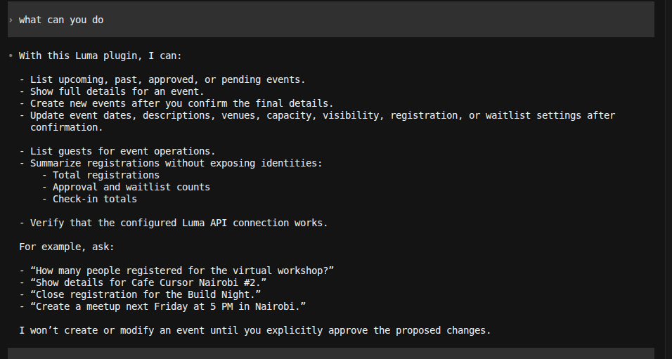
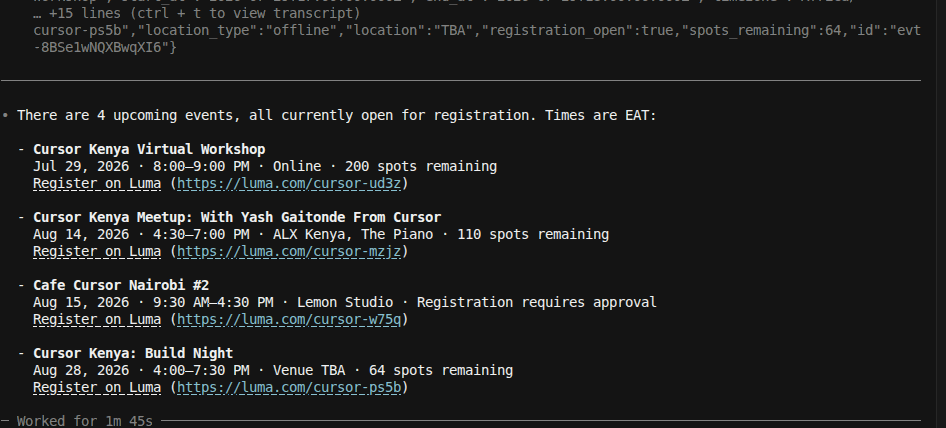
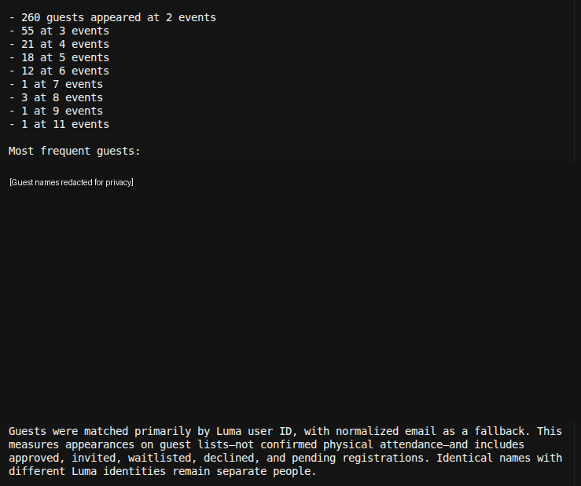

[](https://www.npmjs.com/package/luma-events)
[](https://github.com/Blackie360/luma-events-mcp/actions/workflows/publish.yml)
[](https://www.npmjs.com/package/luma-events)
[](LICENSE)

# Luma Events MCP Server

The Luma Events MCP Server connects AI tools directly to your Luma calendar.
It lets agents create and manage events, work with guests and tickets, organize
hosts, send invitations, approve waitlists, and summarize registrations through
natural-language requests.

Built for event organizers who want Luma operations inside Codex, Cursor, or
another modern MCP client—without giving up explicit confirmation before
important changes.

> [!IMPORTANT]
> This is an independent, community-built project and is not affiliated with or
> endorsed by Luma.

> [!WARNING]
> Version 0.6.0 and newer support only MCP
> `2026-07-28` through the MCP TypeScript SDK v2. Clients that use the legacy
> `initialize` flow or a 2025 protocol revision are rejected instead of being
> silently downgraded.

### Use cases

- **Event operations:** Create, update, inspect, and safely delete events.
- **Guest management:** Add guests, change approval states, and manage guest tickets.
- **Ticketing:** Create free, paid, or flexible-price ticket types and control sales.
- **Host coordination:** Add managers or check-in staff and control public visibility.
- **Audience growth:** Invite people from past events without exposing preview identities.
- **Registration intelligence:** Review attendance, waitlists, and check-ins from aggregate data.

[Quick start](#quick-start) · [Tools](#tools) · [Safety](#confirmation-and-safety) ·
[Examples](#example-prompts) · [Development](#development)

---

## Quick start

### Prerequisites

1. [Node.js](https://nodejs.org/) 20 or newer.
2. A Luma calendar with API access.
3. A calendar API key from the
   [Luma API settings](https://docs.luma.com/reference/getting-started-with-your-api).
4. An MCP client that supports the `2026-07-28` protocol revision, such as a
   current version of
   [OpenAI Codex](https://developers.openai.com/codex/) or
   [Cursor](https://www.cursor.com/).

Your API key controls which calendar the server can access. Treat it like a
password: do not commit it, paste it into issues, or include it in screenshots.

### Interactive installation

Run the setup wizard without cloning the repository:

```bash
npx -y luma-events setup
```

> [!NOTE]
> Releases through `0.7.2` used the package name
> `@blackie360/luma-events-mcp`. Run the shorter command above once to update
> existing client configurations to `luma-events`.

```text
 _     _   _ __  __    _
| |   | | | |  \/  |  / \
| |   | | | | |\/| | / _ \
| |___| |_| | |  | |/ ___ \
|_____|\___/|_|  |_/_/   \_\
          EVENTS MCP
  Safe setup for your AI clients
```

The wizard:

1. Opens with a compact ASCII banner and numbered setup stages, with color only
   when the terminal supports it.
2. Detects installed Codex, Cursor, Claude Code, Gemini CLI, and Grok CLI clients.
3. Lets you select one, several, or all detected clients with ↑/↓, Space, and
   Enter. Press `a` to select or clear all clients.
4. Prompts you to paste your Luma calendar API key with masked terminal input.
5. Verifies the key with Luma before changing anything.
6. Shows the exact installation plan and waits for final confirmation.
7. Configures each selected client and reports individual successes or failures.

The API key is stored once and is never included in client command arguments or
MCP configuration. POSIX systems apply owner-only file permissions; Windows
stores the file inside the current user's application-data directory:

- Linux and macOS: `~/.config/luma-events-mcp/credentials.json`
- Windows: `%APPDATA%\luma-events-mcp\credentials.json`

Existing Cursor configuration is merged rather than replaced, and the original
file is backed up first. Preview detection without requesting a key or changing
configuration with:

```bash
npx -y luma-events setup --dry-run
```

| Client | Setup adapter |
| --- | --- |
| OpenAI Codex | `codex mcp add` |
| Cursor | Safe merge into the global `mcp.json` |
| Claude Code | `claude mcp add --scope user` |
| Gemini CLI | `gemini mcp add --scope user` |
| Grok CLI | `grok mcp add` |

Restart the configured clients after setup, then ask:

> Verify my Luma connection.

### Manual installation

Use the following client-specific configuration when you do not want to use
the interactive wizard.

### Install in OpenAI Codex

Export your Luma API key in the environment that starts Codex:

```bash
export LUMA_API_KEY="your-luma-api-key"
```

Add the following to `~/.codex/config.toml`:

```toml
[mcp_servers.luma-events]
command = "npx"
args = [
  "-y",
  "--package",
  "luma-events@latest",
  "luma-events"
]
env_vars = ["LUMA_API_KEY"]
```

Restart Codex or open a new chat, then ask:

> Verify my Luma connection.

Codex supports `env_vars` for forwarding selected local environment variables
to a stdio MCP server. This keeps the key out of the tracked project and the
MCP definition.

### Install in Cursor

Add this server to your Cursor MCP configuration:

```json
{
  "mcpServers": {
    "luma-events": {
      "type": "stdio",
      "command": "npx",
      "args": [
        "-y",
        "--package",
        "luma-events@latest",
        "luma-events"
      ],
      "env": {
        "LUMA_API_KEY": "your-luma-api-key"
      }
    }
  }
}
```

Prefer Cursor's secret or environment-variable support when available instead
of storing the key directly in a configuration file. Restart Cursor, open
**Cursor Settings → Tools & MCP**, enable `luma-events`, and verify the
connection.

### Install in another MCP client

Any client that supports local stdio MCP servers can launch the npm package:

```json
{
  "mcpServers": {
    "luma-events": {
      "command": "npx",
      "args": [
        "-y",
        "--package",
        "luma-events@latest",
        "luma-events"
      ],
      "env": {
        "LUMA_API_KEY": "your-luma-api-key"
      }
    }
  }
}
```

Configuration syntax and secret handling vary by client. Consult your client's
MCP documentation if it uses a different server key or environment format.

### Install globally

```bash
npm install --global luma-events
luma-events setup
```

Running `luma-events` without a subcommand starts the stdio server. It
normally appears idle when run directly because an MCP client is expected to
communicate with it over standard input and output.

---

## Confirmation and safety

Every write tool requires `confirmed=true`. Until then, the server performs no
write and either returns a structured preview or asks the client to show the
proposed arguments.

Higher-impact operations provide additional safeguards:

- Event deletion previews the exact event, guest impact, and paid-event refund choice.
- Guest status changes require a refund decision when captured paid tickets are involved.
- Guest ticket previews explain that additions are complimentary and removals do not refund.
- Ticket-type deletion verifies that the ticket belongs to the selected event.
- Host removal matches the requested email case-insensitively before proceeding.
- Cross-event audience previews return counts rather than guest identities.
- Waitlist approvals are limited to resumable batches of 90 guests.

> [!CAUTION]
> Confirmation makes the intended action explicit; it does not make a
> destructive action reversible. Review the event, target, notification, and
> refund details before approving a write.

---

## Tools

The server exposes 23 tools. Read tools are marked read-only in MCP discovery;
destructive and potentially non-idempotent operations include matching MCP
annotations so clients can apply their own approval policies.

### Connection and events

| Tool | What it does | Write behavior |
| --- | --- | --- |
| `verify_connection` | Checks the API key and returns the authenticated Luma user. | Read-only |
| `list_events` | Lists approved or pending events with date filters and pagination. | Read-only |
| `get_event` | Returns complete details for one event. | Read-only |
| `create_event` | Creates an event with registration, location, visibility, and capacity settings. | Confirmation required |
| `update_event` | Updates selected event fields. | Confirmation required |
| `delete_event` | Uses Luma's two-step cancellation flow and reports guest/refund impact. | Preview, confirmation, destructive |

### Guests and registrations

| Tool | What it does | Write behavior |
| --- | --- | --- |
| `get_guest` | Finds one guest by ID, ticket key, guest key, or email. | Read-only; returns personal data |
| `list_guests` | Lists event guests, optionally filtered by approval status. | Read-only; returns personal data |
| `registration_summary` | Counts registration states and check-ins without returning identities. | Read-only |
| `add_guests` | Registers guests as approved, pending approval, or waitlisted. | Confirmation required |
| `update_guest_status` | Moves one guest between approved, declined, pending, and waitlist states. | Preview, confirmation, refund-aware |
| `update_guest_tickets` | Adds complimentary tickets or invalidates existing tickets. | Preview, confirmation, non-idempotent |
| `approve_waitlisted_guests` | Approves up to 90 waitlisted guests per resumable run. | Confirmation required |

### Ticket types

| Tool | What it does | Write behavior |
| --- | --- | --- |
| `list_ticket_types` | Lists visible ticket types and optionally includes hidden ones. | Read-only |
| `get_ticket_type` | Returns one ticket type by ID. | Read-only |
| `create_ticket_type` | Creates free, paid, or flexible-price ticket types. | Confirmation required |
| `update_ticket_type` | Changes pricing, availability, approval, visibility, or sale settings. | Confirmation required |
| `delete_ticket_type` | Verifies event ownership and previews the exact ticket type. | Preview, confirmation, destructive |

Luma may reject ticket-type deletion when tickets have already been sold or
when the target is the event's last visible ticket type.

### Hosts

| Tool | What it does | Write behavior |
| --- | --- | --- |
| `add_host` | Adds a visible or hidden manager, check-in host, or no-access host. | Confirmation required |
| `update_host` | Changes a host's access level or public visibility. | Confirmation required |
| `remove_host` | Resolves and previews the host before removal. | Preview, confirmation, destructive |

Luma can omit hidden hosts from an event response. When that happens, the
removal preview clearly marks the requested email as unverified.

### Invitations and audiences

| Tool | What it does | Write behavior |
| --- | --- | --- |
| `send_invites` | Sends soft invitations in batches of 100 by email and, when linked, SMS. | Confirmation required |
| `invite_guests_from_event` | Builds a deduplicated audience from earlier events and removes existing target-event guests. | Identity-free preview, confirmation required |

---

## Example prompts

### Discover and understand

- "Verify my Luma connection."
- "Show my upcoming Luma events."
- "Summarize registrations for my next event."
- "List every ticket type for this event, including hidden tickets."

### Manage events and guests

- "Prepare an event for Friday at 5 PM, but do not create it until I confirm."
- "Add these guests as pending approval after showing me the proposed change."
- "Preview approving this guest and tell me whether a refund choice is involved."
- "Preview replacing this guest's workshop ticket without sending email."

### Grow and operate

- "Show how many guests are waitlisted, then approve a safe batch after I confirm."
- "Preview guests from my last event who are not already on my next event."
- "Invite that previewed audience after I confirm."
- "Add this person as hidden check-in staff after I confirm."
- "Preview deleting this event, including guest and refund impact."

---

## Screenshots

### Discover available capabilities



### List upcoming events



### Analyze guest attendance

Guest identities have been redacted from this public example.



---

## Configuration

| Variable | Required | Default | Description |
| --- | --- | --- | --- |
| `LUMA_API_KEY` | No after setup | Stored credential | Calendar-scoped API key. An environment value overrides the stored key. |
| `LUMA_API_BASE` | No | `https://public-api.luma.com` | Alternate API base for tests or compatible proxies. |
| `LUMA_API_KEY_FILE` | No | Platform credential path | Override the stored credential file location. |
| `LUMA_EVENTS_CONFIG_DIR` | No | Platform config directory | Override the setup directory containing `credentials.json`. |

The server does not load `.env` files automatically. For source development,
copy the included template and load it into your shell:

```bash
cp .env.example .env
set -a
source .env
set +a
```

Never commit `.env` or `LUMA_API_KEY`.

---

## Build from source

Clone the repository:

```bash
git clone https://github.com/Blackie360/luma-events-mcp.git
cd luma-events-mcp
```

Install dependencies and build:

```bash
corepack enable
pnpm install
pnpm build
```

Start the local stdio server:

```bash
pnpm start
```

The generated production entry point is `dist/index.js`. The repository also
includes project-local Cursor configuration, MCP plugin configuration, and
Codex/Cursor plugin manifests.

---

## Development

```bash
# Type-check the project
pnpm check

# Build and run the complete test suite
pnpm test

# Inspect the package that would be uploaded to npm
pnpm pack
```

`prepack` runs the compiler and full test suite before creating the archive.
Tests cover confirmation guards, event deletion, API errors, pagination,
resumable waitlist approval, invitation batching, audience deduplication,
refund rules, ticket invariants, host matching, privacy-conscious previews, and
modern MCP discovery. The integration suite launches the packaged stdio server,
pins negotiation to MCP `2026-07-28`, verifies all 23 tools, and confirms that a
legacy `initialize` request is rejected. Setup tests cover client detection,
selection, masked-secret ordering, API-key verification, consent, restrictive
file permissions, Cursor configuration preservation, and secret non-disclosure.

### Project structure

```text
.
├── .codex-plugin/plugin.json   # Codex plugin metadata
├── .cursor/mcp.json            # Project-local Cursor configuration
├── .cursor-plugin/plugin.json  # Cursor plugin metadata
├── .github/workflows/          # Trusted npm publishing workflow
├── .mcp.json                   # Plugin MCP server configuration
├── docs/images/                # Redacted README screenshots
├── scripts/prepare-release.mjs # Automatic release version synchronization
├── src/index.ts                # Server and Luma API integration
├── src/index.test.ts           # Unit tests
├── src/mcp.integration.test.ts # MCP integration tests
├── src/setup.ts                # Interactive multi-client setup wizard
├── src/setup.test.ts           # Setup and credential-safety tests
├── package.json
└── tsconfig.json
```

### Automatic release process

Every non-release commit that reaches `main`—through a direct push or a merged
branch—runs `.github/workflows/publish.yml`. The serialized workflow:

1. Uses the version in `package.json` when that version has not been published.
2. Otherwise advances the highest published stable version by one patch.
3. Synchronizes the npm package, runtime, Codex, and Cursor versions.
4. Runs the type-checker, all tests, the production build, and `git diff --check`.
5. Commits generated release metadata when needed and creates the matching tag.
6. Publishes through npm trusted publishing and creates a GitHub Release.

Release commits use `chore: release vX.Y.Z` and are pushed with the workflow's
`GITHUB_TOKEN`, so GitHub does not create a recursive workflow run. The
workflow concurrency guard ensures that only one npm publication runs at a
time. Maintainers can also start the same process manually with
**Actions → Publish npm package → Run workflow**.

---

## Security and privacy

- Use a calendar-scoped API key with only the access the integration needs.
- The setup wizard stores the key once, uses owner-only permissions on POSIX, and keeps it out of client arguments.
- Keep API keys, guest information, and registration answers out of commits and issues.
- Prefer `registration_summary` when aggregate counts are enough.
- Use `list_guests` and `get_guest` only for legitimate event operations.
- Review every preview before confirming guest, ticket, host, invitation, or deletion writes.
- Remember that disabling email does not necessarily suppress Luma's in-app notification.
- Rotate a key immediately if it is exposed.

To report a vulnerability, use a private security report rather than a public
issue whenever possible.

## Contributing

Contributions are welcome:

1. Fork the repository.
2. Create a focused branch.
3. Add or update tests for the change.
4. Run `pnpm check` and `pnpm test`.
5. Open a pull request that explains the change and its motivation.

Do not include real API keys, guest identities, or private event data in tests,
commits, issues, or pull requests.

## Support

- Report bugs and request features through
  [GitHub Issues](https://github.com/Blackie360/luma-events-mcp/issues).
- Review published changes in
  [GitHub Releases](https://github.com/Blackie360/luma-events-mcp/releases).
- Install the latest package from
  [npm](https://www.npmjs.com/package/luma-events).

## API

The server uses Luma's official API at `https://public-api.luma.com`. Request
shapes are based on Luma's
[OpenAPI specification](https://public-api.luma.com/openapi.json). API keys are
scoped to the calendar and permissions configured in Luma.

## License

This project is available under the [MIT License](LICENSE).
